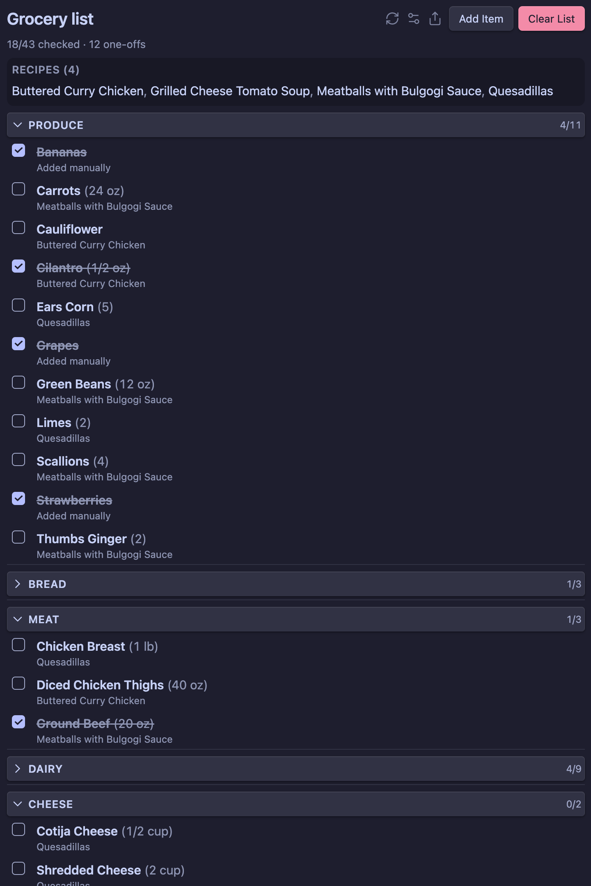
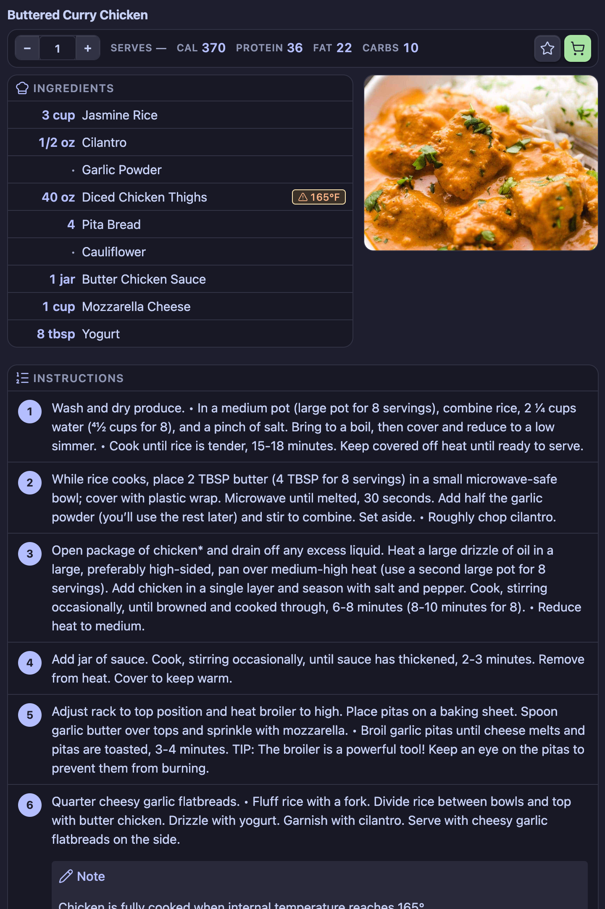

# Pantry

An [Obsidian](https://obsidian.md) plugin that turns recipe notes into a consolidated, category-grouped grocery list you can check off while shopping — and renders those recipe notes as interactive cards while you cook.

## Screenshots

Grouped grocery list with recipe links, checkboxes, and category sections:



Recipe view with hero image, scaled ingredients, instructions, and portion multiplier:



## Features

- **Recipes-as-source-of-truth.** Mark any recipe note with a single boolean frontmatter property to add it to this week's list.
- **Automatic consolidation.** Ingredients shared across recipes are merged. `1 cup milk` + `2 cups milk` becomes `3 cup milk`.
- **Smart grouping.** Items are grouped by category (Produce, Dairy & Eggs, Pantry, ...) so the list matches the layout of your store. Switch to by-recipe or a flat list at any time.
- **One-off items.** Add anything that isn't tied to a recipe (paper towels, snacks). One-offs live alongside recipe items and clear with the rest of the list.
- **Persistent checkboxes.** Tick items off as you shop. Your progress survives restarts until you officially clear the list.
- **Collapsible sections.** Click any section header to collapse or expand it. Sections you finish shopping auto-collapse so the next aisle stays in view (toggleable in settings).
- **Custom recipe view.** Notes flagged with `type: recipe` open in a dedicated view with a hero image, nutrition card, an instructions panel, meat-temperature warnings, and a portion multiplier that scales both the displayed quantities *and* the grocery list.
- **Diet & cooking-time badges.** Add `diet`, `prepTime`, and `cookTime` to the frontmatter and the recipe view shows them as quick-glance badges below the title.
- **Allergen warnings.** Set your personal allergens in settings; recipes whose `allergens` frontmatter overlaps yours show a red banner in the recipe view and a warning icon next to the recipe in the grocery list.
- **Favorites.** Star a recipe with one click and the `favorite: true` frontmatter is set automatically. Used by the meal recommender.
- **Last-made tracking & cook counts.** Optionally stamp today's date into `lastMade` and increment `cookedCount` whenever you add a recipe to the grocery list — powering the cooking-stats leaderboard.
- **Meal recommender.** "Suggest a meal" surfaces recipes you haven't cooked recently, with optional filters for favorites and allergens.
- **Cooking stats leaderboard.** "Show cooking stats" ranks every recipe by how often you've cooked it.
- **Export & share.** Copy the current grocery list to the clipboard or append it to any note as plain text, a Markdown checklist, or grouped by category.
- **Diabetic mode.** Optional toggle that surfaces high-glycemic-index ingredients with an inline `↑ GI` badge in the recipe view. Ships with a curated regex dictionary you can edit freely.
- **One command to start fresh.** "Clear grocery list" deselects every flagged recipe, removes all one-offs, and resets all checks.

## Quick start

1. Build and load the plugin (see [Development](#development)).
2. Open **Settings → Community plugins → Pantry** and configure:
   - **Recipe folders** — vault folders to scan (leave blank to scan everything).
   - **Selection property** — the frontmatter field that marks a recipe for the week (default: `groceryList`).
   - **Ingredients heading** — the heading that introduces each recipe's ingredient list (default: `Ingredients`).
3. Tag a recipe note for the week:
   ```markdown
   ---
   groceryList: true
   ---

   # Pasta with Tomato Sauce

   ## Ingredients
   - 1 lb spaghetti
   - 2 cups crushed tomatoes
   - 3 cloves garlic
   - 2 tbsp olive oil
   - salt to taste
   ```
4. Open the grocery list with the ribbon icon (shopping cart) or the **Open grocery list** command.

## Recipe format

The plugin looks for the configured **Ingredients heading** (any level) inside each selected recipe and parses every list item beneath it as an ingredient. If no matching heading is found, every list item in the file is parsed.

Each ingredient line is interpreted as `[quantity] [unit] [name]`. Supported quantities include whole numbers, decimals, simple fractions (`1/2`), mixed fractions (`1 1/2`), and unicode fractions (`½`). Common units (cup, tbsp, tsp, oz, lb, g, kg, can, clove, bunch, ...) are recognised and normalised so plurals consolidate. Trailing parentheticals like `(diced)` are stripped before consolidation.

Lines without a recognisable quantity (`salt to taste`) still appear on the list - they just won't aggregate quantities.

### Skipping ingredients

Append `#IgnoreIngredient` to any ingredient line you don't want on the shopping list (pantry staples you always have on hand, garnishes, water, etc.):

```markdown
- 2 tbsp olive oil #IgnoreIngredient
- salt to taste #IgnoreIngredient
- 1 lb spaghetti
```

The tag is matched case-insensitively; `#ignoreingredient`, `#ignore-ingredient`, and `#ignore_ingredient` all work too. Ignored lines are dropped before consolidation, so they won't show up under any category.

## Recipe view

Pantry ships a custom view for recipe notes. To opt a note in, add `type: recipe` to its frontmatter (the value is configurable in **Settings → Recipe view**). When auto-open is on (the default), opening such a note switches the leaf into the recipe view automatically; you can always switch back with the **Edit as Markdown** button in the view's action bar, the **Recipe mode** entry in the pane's three-dot menu, or the **Open as Markdown** command.

The view shows a meta banner with the multiplier, servings, and nutrition; a hero image card; a tabular ingredients list with safe-cooking-temperature badges next to detected meats; and a numbered instructions card.

Frontmatter properties the view reads and writes:

| Property | Type | Purpose |
| --- | --- | --- |
| `type` | string | When equal to `recipe` (case-insensitive), opens the file in the recipe view. |
| `image` | string | Hero image for the recipe. Accepts a wikilink (`[[my-photo.jpg]]`), a vault-relative path, or an external URL. The key is matched case-insensitively (`Image`, `IMAGE`). |
| `multiplier` | number | Portion multiplier (default `1`, minimum `0.5`). Scales the displayed ingredient quantities, the grocery list contribution, and the displayed servings count. **Does not** change per-serving nutrition. |
| `servings` | number | Optional. Used to compute per-serving nutrition. |
| `calories`, `protein`, `fat`, `carbs` | number | Totals for the recipe **as written** (multiplier `1`). Per-serving values are computed by dividing by `servings`. |
| `diet` | array of strings | Diet tags shown as badges (e.g. `["vegan", "gluten-free"]`). Free-form. |
| `allergens` | array of strings | Allergens this recipe contains (e.g. `["nuts", "dairy"]`). Compared case-insensitively against your allergen list in settings. |
| `prepTime`, `cookTime`, `totalTime` | number | Minutes. `totalTime` is computed from `prepTime + cookTime` when not provided. |
| `favorite` | boolean | Set with one click via the star button in the recipe view. |
| `lastMade` | date | Auto-stamped to today's date when you add the recipe to the grocery list (configurable in settings). |
| `cookedCount` | number | Auto-incremented when `lastMade` advances to a new day. Powers the cooking stats leaderboard. |

Example:

```markdown
---
type: recipe
image: "[[pasta-photo.jpg]]"
groceryList: true
multiplier: 1.5
servings: 4
calories: 720
protein: 28
fat: 18
carbs: 96
---

## Ingredients
- 1 lb spaghetti
- 2 cups crushed tomatoes
- 3 cloves garlic

## Instructions
1. Boil water and salt heavily.
2. Cook spaghetti to al dente.
3. Toss with sauce and serve.
```

With `multiplier: 1.5`, the recipe view shows `1.5 lb spaghetti` and the grocery list adds `1.5 lb spaghetti` (consolidating with any other recipe that also calls for spaghetti). Servings displays `Serves 6` (4 × 1.5). Per-serving nutrition stays constant at the values derived from `nutrition / servings`. The grocery list also displays the multiplier badge next to recipe links so you can see at a glance which recipes are scaled up or down.

## Commands

| Command | Description |
| --- | --- |
| Open grocery list | Reveal the grocery list in the right sidebar. |
| Refresh grocery list from recipes | Re-scan selected recipes. Runs automatically on file changes. |
| Add one-off grocery item | Open the modal to add a one-off. |
| Reset grocery list checks | Uncheck everything without removing items. |
| Clear grocery list | Remove all recipe selections, one-offs, and checked state. |
| Toggle this recipe in the grocery list | Toggle the selection property on the active note. |
| Open as recipe | Switch the active markdown note into the recipe view. |
| Open as Markdown | Switch the active recipe view back to standard Markdown editing. |
| Suggest a meal | Open a modal with N recipes you haven't cooked recently. Filter by favorites, hide allergens. |
| Show cooking stats | Open the leaderboard ranking every recipe by `cookedCount`. |
| Export grocery list | Copy the current list to the clipboard or append it to a note (plain, checklist, or grouped). |

All commands appear in the command palette under the **Pantry:** prefix.

## Meal recommender, leaderboard, and export

- **Suggest a meal** picks recipes from your library (anything with `type: recipe` in the configured folders) that you haven't cooked within the **Suggestion day window** (default: 14 days). The window and number of suggestions live in **Settings → Recipe library**.
- **Show cooking stats** sorts the same library by `cookedCount` (descending), then by `lastMade`. Click any row to jump straight to the recipe.
- **Export grocery list** opens a modal with a live preview and three formats (plain text, Markdown checklist, Markdown grouped by category). Copy to the clipboard or append to a note path of your choice; missing notes are created automatically.

## Allergens

Add a comma-separated list of allergens you care about in **Settings → Recipe library → My allergens** (e.g. `nuts, dairy`). Pantry compares them, case-insensitively, against each recipe's `allergens` frontmatter:

- The recipe view shows a red **Allergen warning** banner above the ingredients.
- The grocery list shows a triangle warning icon next to the recipe link, with a tooltip listing the matching allergens.
- The meal recommender hides matching recipes by default (toggleable per-session).

## Diabetic mode

Enable **Settings → Diabetic mode → Enable diabetic mode** to surface high-glycemic-index ingredients in the recipe view. When the cleaned ingredient name matches a regex in the dictionary, an `↑ GI` badge appears next to it (alongside the meat-temperature badge for meats). Hovering shows a tooltip explaining the warning.

When diabetic mode is on, the **High GI dictionary** editor appears below the toggle. It's a plain text area with one regex per line:

```
# High glycemic index (GI ≥ 70) ingredients.
# One regex per line, case-insensitive. Lines starting with # are comments.

\bwhite\s+rice\b
\bbaguette\b
\bmashed\s+potato(es)?\b
\bcorn\s+syrup\b
\bwatermelon\b
```

Patterns are case-insensitive and matched against the cleaned ingredient name (no quantity, no markdown, no trailing tags). Invalid patterns are skipped silently and surfaced in a small red panel below the editor so they're easy to fix. The **Reset GI dictionary** button restores the shipped list.

GI values vary by source, preparation, and even cultivar - this list is informational only and is not medical advice. Tune the dictionary to match your own dietary plan, and treat it as a hint rather than a verdict.

When diabetic mode is off, no GI badges appear and the dictionary editor stays hidden.

## Categories

There are three ways to assign categories, controlled by **Settings → Category source**:

- **Built-in dictionary** (default) - items are matched against a keyword dictionary covering common US grocery aisles.
- **Recipe tags** - if your ingredient lines end with an Obsidian tag (e.g. `- 1 lb Ground Beef #Meat`), the trailing tag becomes the category. Items with no tag fall into "Other."
- **Recipe tags, then dictionary** - prefer the trailing tag, fall back to the dictionary when no tag is present.

When multiple recipes contribute different tags for the same merged item, the most common tag wins (ties broken by first-seen order).

You can override or extend the dictionary at any time in **Settings → Category overrides** with one entry per line:

```
oat milk: Dairy & Eggs
seltzer: Beverages
chocolate chip: Pantry
```

Matches are case-insensitive substrings of the ingredient name; the longest match wins. Overrides take precedence over both tags and the dictionary.

The order in which categories appear in the view is configurable via **Category order**. Unknown categories are appended alphabetically.

## Privacy

The plugin runs entirely offline. It only reads notes inside the configured recipe folders, only writes to its own data file, and only modifies recipe frontmatter when you explicitly clear the list, use the toggle command, or change the multiplier in the recipe view.

## Development

```bash
npm install
npm run dev      # watch + rebuild main.js
npm run build    # type-check and produce a production main.js
npm run lint     # run eslint
```

To test locally, this folder must live at `<Vault>/.obsidian/plugins/pantry/` (matching the `id` in `manifest.json`). After building, reload Obsidian and enable **Pantry** under **Settings → Community plugins**.

## Release

Attach `main.js`, `manifest.json`, and `styles.css` as individual assets to a GitHub release whose tag exactly matches the `version` in `manifest.json` (no leading `v`).

## Support

[](https://ko-fi.com/Z8Z31YAERO)
